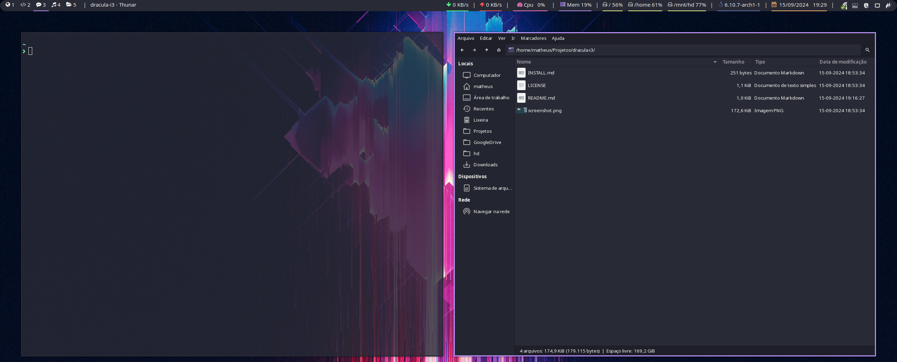

# Dracula for [i3](https://i3wm.org/)

> A dark theme for [i3](https://i3wm.org/).

### Use with native i3bar

### Use with alternative Polybar

## Install

All instructions can be found at [draculatheme.com/i3](https://draculatheme.com/i3)

## Team

This theme is maintained by the following person(s) and a bunch of [awesome contributors](https://github.com/dracula/i3/graphs/contributors).

|  |  |
| --- | --- |
| [Guido Kroon](https://github.com/gkroon) | [Matheus Ortiz](https://github.com/matheusortiz) |

## Community

- [Twitter](https://twitter.com/draculatheme) - Best for getting updates about themes and new stuff.
- [GitHub](https://github.com/dracula/dracula-theme/discussions) - Best for asking questions and discussing issues.
- [Discord](https://draculatheme.com/discord-invite) - Best for hanging out with the community.

## License

[MIT License](./LICENSE)
